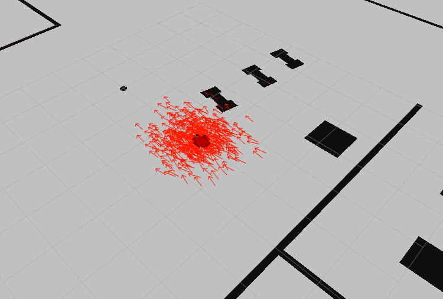
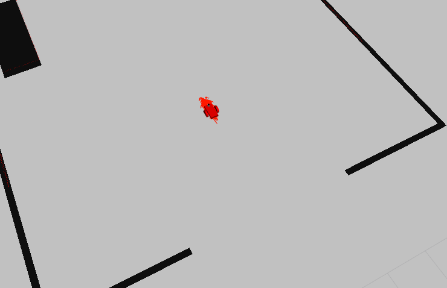

# Where Am I

## Project Discription

1. Create a ROS package that launches a custom robot model in a custom Gazebo world
2. Utilize the ROS AMCL package and the Tele-Operation/Navigation Stack to localize the robot
3. Explore, add, and tune specific parameters corresponding to each package to achieve the best possible localization results

## Launch

- Clone this repository
- Open the repository and make

```
cd ~/<YOUR WORKSPACE>
catkin_make
```

```roslaunch my_robot world.launch```
	Open a new terminal and type
```roslaunch my_robot amcl.launch```

## Test

There are two options to control the robot while it localize itself:
- Send ```navigation goal``` via RViz
- Send move command via ```teleop``` package
	
### Option 1: Send ```2D Navigation Goal```

Click the ```2D Nav Goal``` button in the RViz toolbar, then click and drag on the map to send the goal to the robot. It will start moving and localize itself in the process

### Option 2: Use ```teleop```

Open another terminal and launch the teleop node:
```rosrun teleop_twist_keyboard teleop_twist_keyboard.py```

## Project screenshots
Screenshot of localized robot in RViz


